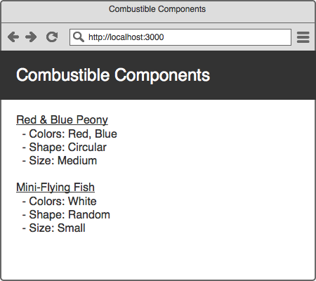

# Combustible Components

This project was bootstrapped with [Create React App](https://github.com/facebookincubator/create-react-app).

## Getting Started

* Run the `create-react-app` command and `cd` into the created directory

* Create a new git repository and commit your code

* Add Bootstrap 4 via the CDN:
  ```html
  <link href="https://maxcdn.bootstrapcdn.com/bootstrap/4.0.0-beta.2/css/bootstrap.min.css" rel="stylesheet">
  ```

* Remove css from `index.css`

* Commit your changes

## Description

We'll be building some components to create a dashboard that lists various fireworks and their attributes. To build it, we will be using data like this:

```js
const attributes = [
  { id: 1, kind: 'color', value: 'red' },
  { id: 2, kind: 'color', value: 'white' },
  { id: 3, kind: 'color', value: 'blue' },
  { id: 4, kind: 'shape', value: 'circular' },
  { id: 5, kind: 'shape', value: 'fan' },
  { id: 6, kind: 'shape', value: 'random' },
  { id: 7, kind: 'size', value: 'small' },
  { id: 8, kind: 'size', value: 'medium' },
  { id: 9, kind: 'size', value: 'large' },
]

const fireworks = [
  { id: 1, name: 'Red & Blue Peony', attributeIds: [ 1, 3, 4, 8 ] },
  { id: 2, name: 'Mini-Flying Fish', attributeIds: [ 2, 6, 7 ] }
]
```

The goal for us to make something that looks like this:



## Steps

1. Add Jumbotron
    - Add Bootstrap Jumbotron
1. Add FireworksList Component
    - Create `components/` folder
    - Create FireworksList Component that has a title
    - Include FireworksList in App
1. Add fireworks data and use as props
    - Include fireworks in App
    - Pass fireworks through to FireworksList
    - Show data with `JSON.stringify()`
1. Add FireworkItem Component
    - Create FireworkItem component that takes a firework and renders only the title
    - Loop over fireworks data in the FireworksList
1. List attributes via FireworkAttribute Component
    - Add attributes to the App Component
    - Create FireworkAttribute Component
    - List out attributes (without grouping attributes by kind)
